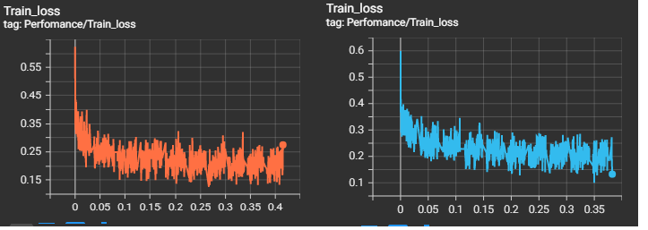
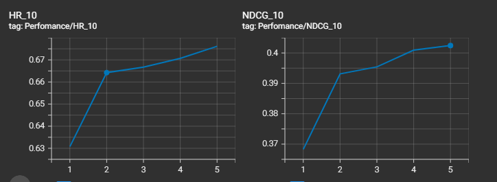

# Neural Collaborative Filtering

This repo contains an implementation of 'Neural Collaborative Filtering' using Pytorch.

&nbsp;  

## Scripts

**config.py:** All the algorithm settings.  
**data_utils.py:** Necessary classes and methods to create and preprocess datasets.  
**model.py:** Class for Neural Collaborative Filtering method. And also function to recommend items.  
**evaluate.py:** Functions for calculating 'Hit Ratio' and 'Normalized Discounted Cumulative Gain Ratio'.  
**main.py:** Main function that runs the algorithm.  

&nbsp;  

## Dataset
MovieLens 1M Dataset is used. Files in dataset:
&nbsp;   
**[movies](data/movies.dat):** movie_id, title, genre  
**[ratings](data/ratings.dat):** user_id, item_id, rating, timestamp  

&nbsp;  

## Model
&nbsp;  The model is a mixture of 'Matrix Factorization' and 'Multi Layer Perceptron' models. First part of the model (MF) is useful to capture linear relationships between users and items, while second part (MLP) is good at modelling non-lineer relationships. In this manner our scoring function is being a combination of MF and MLP algorithms.  
&nbsp;  As a loss function, 'Binary Cross Entropy' is used as the feedbacks are converted into implicit feedback.  

&nbsp;  

Related paper can be found  **[He et al. "Neural Collaborative Filtering" at WWW'17](neural_collaborative_filtering_paper.pdf)**

&nbsp;  

## Results
&nbsp;  **If we add another layer contains 4 nodes to the end of the network:**  
The training loss decreases from 0.274 to 0.133

&nbsp;  **Best hyper-parameters:**  
- epoch: 5  
- learning rate: 0.005  
- batch size: 256  
- dropout: 0.1  

&nbsp;  

&nbsp;  

&nbsp;  **Performance of the best model:**  
- *HR-10*: 0.676158965  
- *NDCG-10*: 0.402437598  

&nbsp;  

# Usage
The project can be run by first setting the parameters in the config.py file, and then running the main.py file.

&nbsp;  

# Deployable Deficiencies
&nbsp;  The model is potentially be suffered from so called 'cold start problem' which is a common problem in the field of recommendation systems This problem refers to lack of sufficient data related to users and items to buid a predictive model effectively. This problem widely occurs when a new product is released or company enters a new market.  
&nbsp;  Potential solution for the cold start problem would be using hybrid approaches. Content-based and collaborative filtering techniques can be mixed by taking into account the structure of the market.
